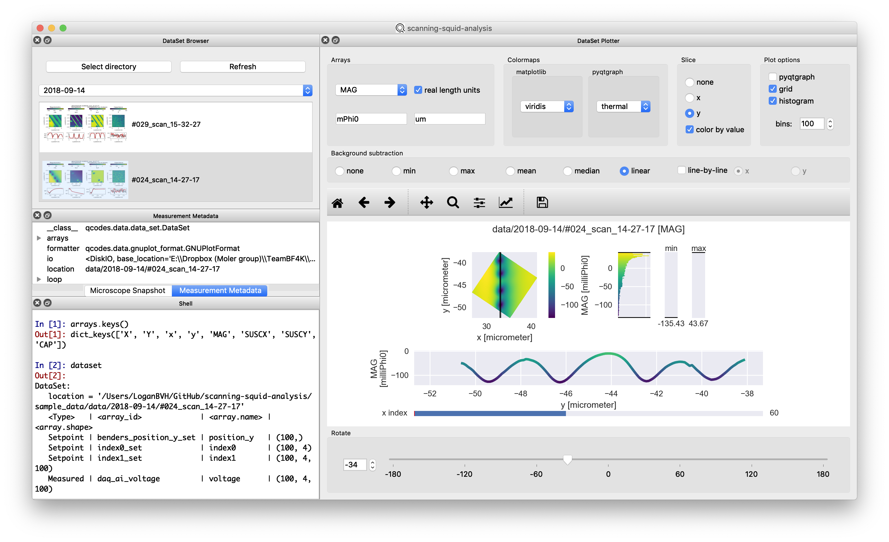

# scanning-squid-analysis
Analysis GUI for scanning SQUID microscopy datasets generated by the [scanning-squid](https://scanning-squid.readthedocs.io/en/latest/) python package.


### Requirements
- [Anaconda 3](https://www.anaconda.com/distribution/#download-section)

### Installation
- [Clone](https://help.github.com/en/articles/cloning-a-repository) or download this repository.

### Setup
#### Windows
- Edit the first line of `create_env.bat`, `remove_env.bat`, and `start_gui.bat` to read `call <path\to\your\Anaconda3>\Scripts\activate.bat`. For most users this is probably `C:\Users\<your-user>\Anaconda3\Scripts\activate.bat`. 
  - If you don't know where to find this, open the Anaconda Prompt and run `where python`. You should see something like `C:\Users\<your-user>\Anaconda3\python.exe` (see [here](https://docs.anaconda.com/anaconda/user-guide/tasks/integration/python-path/)). Then update the first line of the above .bat scripts with `call C:\Users\<your-user>\Anaconda3\Scripts\activate.bat`.
 - Double click `creat_env.bat` to create a `conda env` called `scanning-squid-analysis` with all of the required packages. You only have to do this once, when you first install the program. You can close this cmd window once it reads `Press any key to continue...`.
 - **You can now start the data analysis GUI by double clicking `start_gui.bat`.**
 
#### Mac
 - Edit the second line of `create_env.command` and `remove_env.command` to read `source <path/to/your>/anaconda3/bin/activate`. For most users this is probably `/anaconda3/bin/activate` or `~/anaconda3/bin/activate`.
 - Edit the second line of `start_gui.command` to read `source <path/to/your>/anaconda3/bin/activate scanning-squid-analysis`.
 - Open Terminal and navigate to this repository (`cd <path/to/this/repo>` or `cd <space>` and drag/drop this directory into the Terminal window).
 - In Terminal, run `chmod u+x create_env.command remove_env.command start_gui.command` to give the terminal permission to run these files.
 - Double click `create_env.command` to create a `conda env` called `scanning-squid-analysis` with all of the required packages. You only have to do this once, when you first install the program. You can close this Terminal window once it reads `[Process completed]`.
 - **You can now start the data analysis GUI by double clicking `start_gui.command`.**
 ---------------------------
 
### Usage
- Use the **Select directory** button, *File -> Select directory...*, or ctrl+O (Windows)/cmd+O (Mac) to select the data directory. This base directory (for example `sample_data/data` in this repo) should contain dated subdirectories, which in turn contain single datasets (e.g. `sample_data/data/2018-09-14/#016_scan_13-07-41`).
- Click a specific dataset in the **DataSet Browser** to load its data. The dataset metadata and instrument settings can be examined with the **Measurement Metadata** and **Microscope Snapshot** widgets.
- The arrays contained in the dataset can be visualized/lightly processed in the **DataSet Plotter**.
- The current matplotlib figure can be exported using *Plot -> Export matplotlib...* or ctrl+P (Windows)/cmd+P (Mac).
- The currently displayed data (including any rotations, background subtraction, cross-sections, etc.) can be exported using *File -> Export current data...* or ctrl+S (Windows)/cmd+S (Mac). The available export formats are:
  - MATLAB .mat file: Each array is saved to a struct with field names 'array' and 'unit'.
  - HDF5 .h5 file: Can be read by [h5py](https://www.h5py.org/), [MATLAB](https://www.mathworks.com/help/matlab/ref/hdf5read.html), or viewed with [HDF5 View](https://www.hdfgroup.org/downloads/hdfview/).
  - Python pickle: A dictionary of arrays is written directly to a file in binary form and can be loaded using:
    ```python
    import pickle
    with open('filename.pickle', 'rb') as f:
        arrays = pickle.load(f)
    ```
- The built-in IPython console has access to the following:
  - matplotlib.pyplot: `plt`
  - numpy: `np`
  - a dict of the current arrays in the form of [pint](https://pint.readthedocs.io/en/latest/) `Quantities`: `arrays`. For example, `arrays['MAG'].magnitude` will be the `MAG` array, with units `arrays['MAG'].units`
  - the current `qcodes.data.data_set.DataSet`: `dataset`
  -----------------------------

### Notes
- If you wish to uninstall the program, double click `remove_env.bat` (Windows) or `remove_env.command` (Mac) to remove the `scanning-squid-analysis` `conda env`, then delete this repository.
- If you find bugs/have suggestions for new features, please use the [GitHub Issues feature](https://github.com/loganbvh/scanning-squid-analysis/issues).
- Contact: logan.bvh@gmail.com.
- Logo by [Tom Shahar](http://www.tomshahar.io/).
